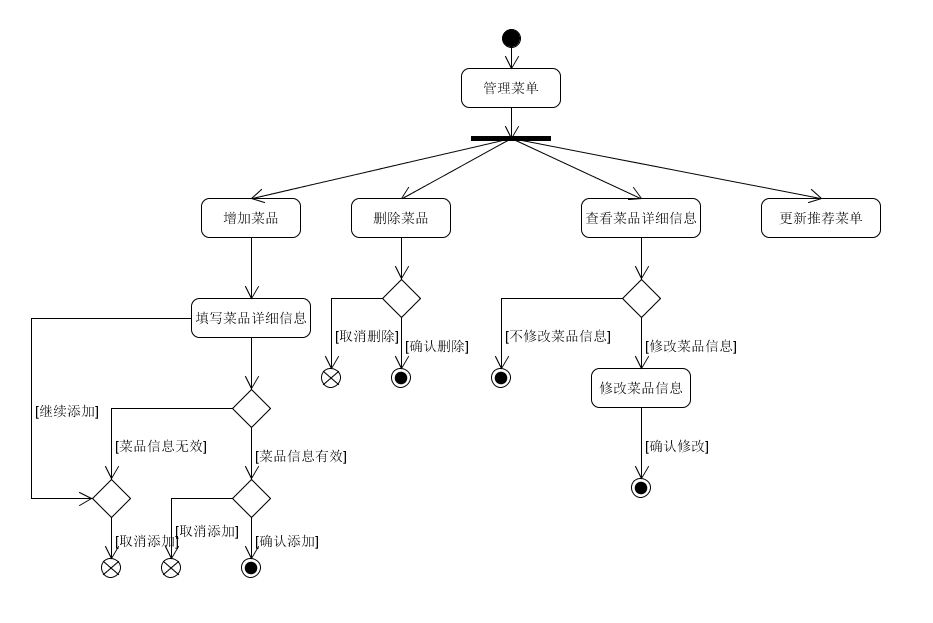
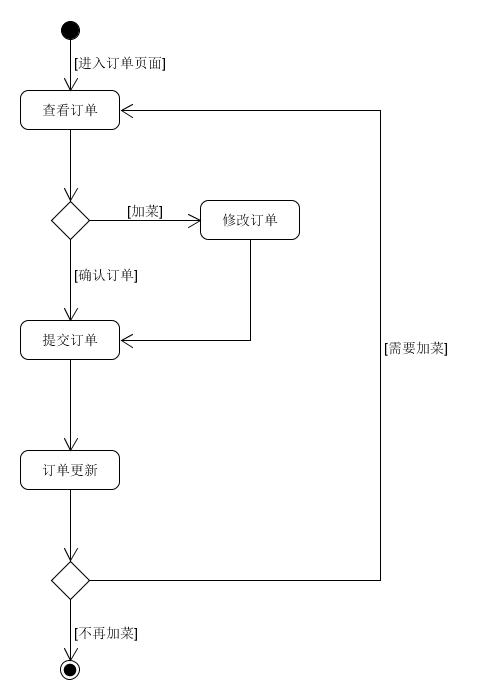

# 6.2 Use Cases

## 详尽用例

### Use Case 1.1 查看订单（商家端）

**范围**：扫码点餐应用

**级别**：用户目标

**主要参与者**：餐厅工作人员

**涉众及其关注点**：餐厅工作人员希望查看当前某一时间段内所有已处理和未处理的订单，并能查看某个订单的详细信息（包括时间、点餐信息、金额等）并处理该订单，包括接收订单和拒绝订单

**前置条件**：每次顾客提交的点餐订单信息，包括订单号、时间、餐桌ID、餐品、金额、支付状态等都能被准确无误地录入系统

**后置条件**：准确地显示订单列表和订单详细信息，保存商家的订单处理方式（接收或拒绝），并反馈给顾客

**主成功场景**：
- 1. 餐厅工作人员点击查看订单功能
- 2. 系统以列表的形式显示最近一段时间内订单的简要信息（订单号、时间、餐桌ID、支付状态）
- 3. 餐厅工作人员点击订单列表中的某一个订单
- 4. 系统显示该订单的所有详细信息
- 5. 餐厅工作人员可以选择处理这些订单，此时点击接受订单或拒绝订单
- 6. 订单处理方式被系统反馈给顾客

**替代流程**：
- 这段时间内没有订单
    - 1.显示为空
- 餐厅工作人员查看订单时顾客取消了订单，此时餐厅工作人员点击处理订单
    - 1.显示订单已被取消，处理订单失败
  
**特殊需求**：
- 新订单到来能通知餐厅工作人员

**发生频率**：不断发生

**未决问题**：

### Use case 1.2 顾客点单 ###
**范围**：点餐应用

**级别**：用户目标

**主要参与者**：顾客

**涉及及其关注点**：

- 顾客：希望便捷、清晰地浏览店铺的菜单，对心仪的菜式进行加入购物车操作； 同一桌上的不同顾客可以同时浏览菜单、选择菜品；可以进行下单后，后续需要可再进行添加菜品；期间可以看到点餐的总金额，最后用餐结束时再进行结账。
- 餐厅工作人员：需要了解顾客该桌的用餐状态；希望快速收到顾客的订单通知；希望能够向顾客反馈信息。
- 餐厅老板：需要编辑餐厅信息，修改菜单等。

**前置条件**：顾客通过在一个特定的桌子坐下扫码成功进入点餐系统。

**后置条件**：成功提交并保存顾客的订单信息，包括菜品品名、数量、金额等。

**主成功场景**：
- 1. 顾客（可多人）扫码进入餐厅主界面。
- 2. 顾客（可多人）浏览菜单
- 3. 查看菜品详情，选择菜品。
- 4. 顾客进行下单，系统存储订单信息，通知工作人员。
- 5. 顾客收到订单受理结果，可查看此桌已点菜品的份数和金额。
- 6. 顾客选择申请订单增加菜品，重复2步骤选择菜品进行补下单
- 7. 顾客用餐结束后，进行支付用餐费用

**替代流程**：

- *a. 顾客在点餐过程的任意时段意外退出小程序：
   1. 系统保存当前顾客的用餐状态。
   2. 顾客重新进入系统后，系统恢复顾客退出之前的界面信息。
- 3a. 顾客选择某样菜品时，该菜品食材无库存
   1. 弹出跳窗告知顾客菜品食材无库存
   2. 将顾客重新定向到菜单界面
- 4a. 顾客欲取消未处理订单
   1. 顾客在订单页面发出取消订单请求
   2. 系统通知工作人员
   3. 工作人员回应
- 4b. 工作人员同意取消订单
   1. 系统撤销订单并回滚相应数据
   2. 系统通知顾客取消订单操作成功
- 4c. 工作人员拒绝取消订单
   1. 工作人员输入拒绝理由
   2. 系统通知顾客请求被拒绝，并显示理由
- 7a. 顾客选择在线付款
   1. 顾客选择支付方式（微信、支付宝）进行付款
- 7b. 顾客选择线下支付
   1. 顾客选择现金支付或信用卡支付

**特殊需求**：
- 需要对顾客订单请求及时处理
- 系统应对业务数据进行实时（隔一段时间）统计

**发生频率**：不断发生

**未决问题**：
- 如何保障系统实时性、安全性、高效性？

## 非正式用例
### 2.1 管理菜单（商家端）
**主成功场景**：需要修改该餐厅菜单的时候，工作人员点击管理菜单功能查看当前的菜单列表，随后可以进行增加菜品、删除菜品、查看菜品详细信息、修改菜品信息和更新推荐菜单等操作

**交替场景**：
- 餐厅从来没有添加过菜品到菜单
    - 1. 显示为空

**活动图**：

### 2.2 顾客提交订单
**主成功场景**：同一桌的顾客们点完餐后，确认完订单后提交订单,订单页显示提交成功

**交替场景**：
- 顾客在提交订单后，需要加菜时，在菜单界面添加菜品后，提交新订单
- 系统存储新订单，并通知工作人员

**活动图**：

## 简洁用例

### Use Case 3.1 注册登录(商家端)
- Actor：餐厅工作人员
- Type：Primary
- Description：工作人员进入管理系统主页，输入帐号密码后点击登录进入该餐厅的管理页面，或者点击注册获取一个餐厅帐号

### Use Case 3.2 生成二维码
- Actor：餐厅工作人员
- Type：Primary
- Description：工作人员点击生成二维码功能，系统将显示点餐界面的网站链接和一个草料二维码网站的入口，工作人员复制点餐界面链接后进入草料二维码网站生成二维码。可以选择生成餐厅唯一的二维码；也可以为每张餐桌生成对应的二维码

### Use case 3.3 查看今日推荐
- Actor：顾客
- Type：Primary
- Description：顾客进入点餐系统，切换到菜品推荐的页面，浏览推荐的菜品列表，并点击感兴趣的菜品，查看相关描述，选择自己喜欢的菜品加入到购物车。
