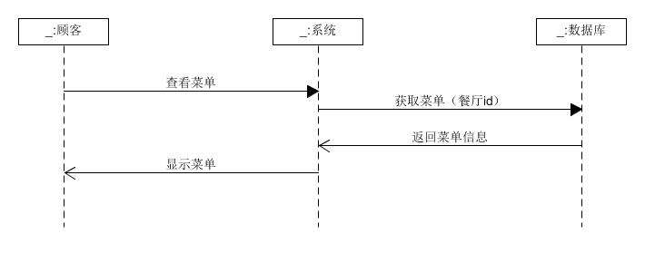
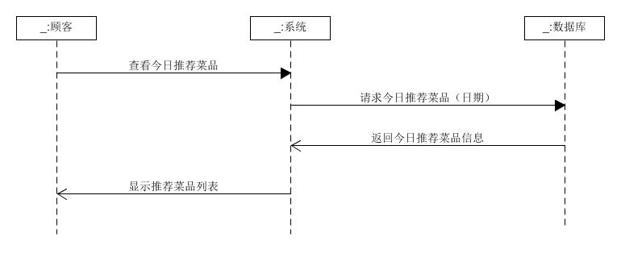
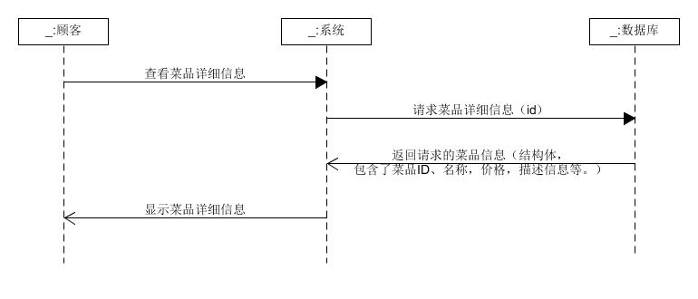
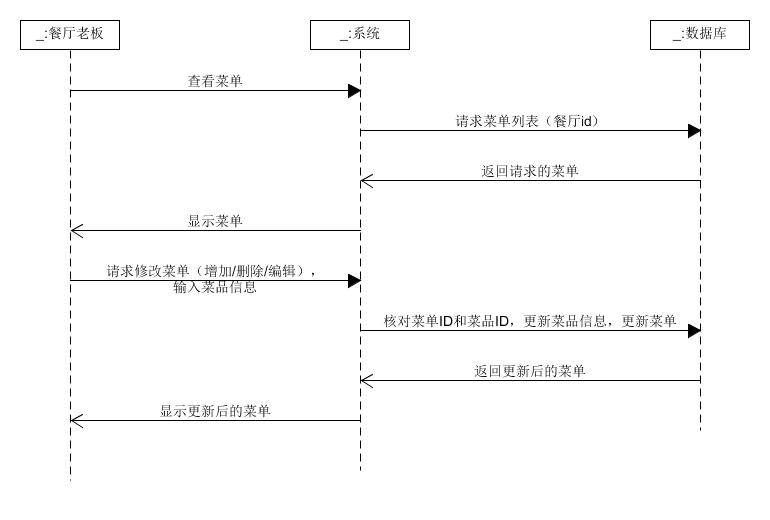
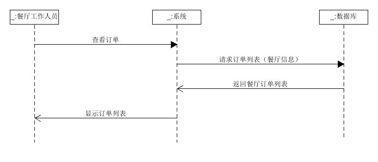

# 6.5 功能模型图

## 基本功能
根据我们的用例分析，罗列出主要功能如下：
1. 浏览菜单
2. 查看今日推荐
3. 查看菜品详细信息
4. 管理菜单
5. 查看订单

还要继续补充

## 系统顺序图
1. 浏览菜单

    by 

2. 查看近日推荐

    by

3. 查看菜品详细信息

    by

4. 管理菜单

    by

5. 查看订单

    by

