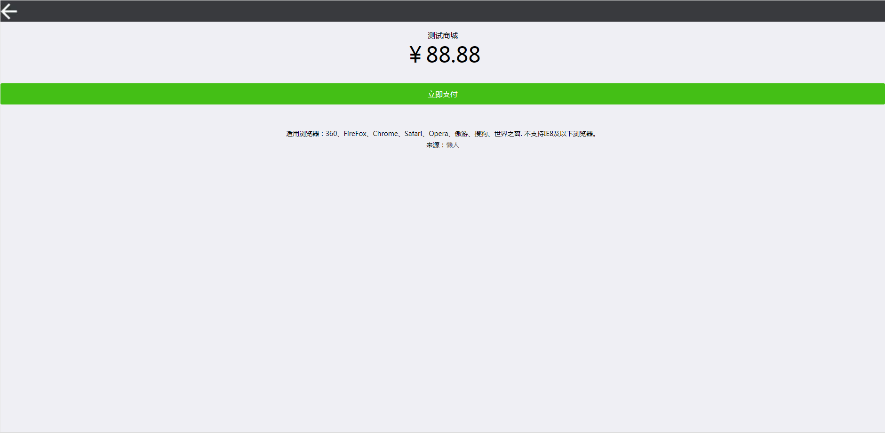

# **UI设计** 

### 总览

按照项目前期调研和项目愿景，注重系统的简洁性和实用性。通过扫码直接进入点餐页面，不设置登录操作。整个点餐系统逻辑上分成两个界面：选购界面和支付界面（为方便修改，以下界面暂时为HTML模式）

### 选购界面

总体上按照现有常见的点餐小程序设计思路，左一栏是对菜品的分类，右边用列表的形式对单个菜品进行展现。这里沿用了传统的点餐程序逻辑：找到对应分类，选择对应分类下的菜品 ，切换分类继续选择，进入购物车结算。

视觉效果上，考虑到交互性，菜品分类栏采用了扁平化设计，可以更加简单直接的将信息和事物的工作方式展示出来，减少认知障碍的产生；同时扁平化设计的视觉效果更简约，条理清晰，最重要的一点是，有更好的适应性。
为了使画面不显得拥挤，右边栏的菜品列表栏采用了卡片设计，这里扁平设计已经不适合多维度信息的表达。点击菜品右下角的按钮，界面底部就会出现关于菜品的详细介绍以及加入购物车的选项。

### 支付界面

当商品选购完之后，点击界面下方“去结算”直接跳转到支付页面。支付页面只显示需要支付的金额，主要是为了使用户加强确认要支付的金额，避免出现金钱交易错误。

### 自评

- 设计逻辑清晰，视觉效果简约；
- 界面设计注重用户体验，操作方便；
- 设计的创新性有待提高