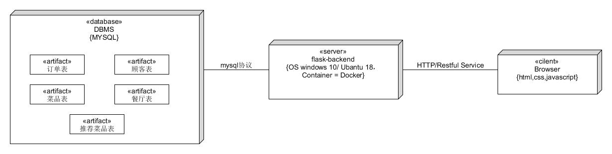

# 软件架构文档

## 架构问题

#### 可靠性
1. 多个顾客同时点单重复提交相同订单的问题

#### 可用性
2. 提供用户友好的订餐功能

## 解决方案说明

#### 可靠性
1. 解决方案概要：使用一个实时生成的token判断用户是否重复提交。

   动机：重复订单会导致上菜错误。

   因素：防止顾客提交相同订单。
   
   解决方案：在前端部分为提交的订单生成一个token储存在会话中，提交订单时检测token是否已经存在，若存在则判断为重复提交订单。token会有一个时间戳，超过特定时间（如1分钟）就会被会话丢弃。

#### 可用性
2. 解决方案概要：使用微信扫码直接进入Web端服务器。

   动机：用户体验对于软件产品来说至关重要，应该操作简单方便。

   因素：简化用户的操作流程，提高开发效率。

   解决方案：引导客户使用微信扫码功能扫描餐厅二维码（标记了餐厅及餐桌号），从而访问点餐网站。点餐网站返回前端代码，由前端代码专门负责提供用户界面，与用户进行交互。前后端有着独立的代码逻辑（用户交互和执行业务），彼此之间通过REST API 交换数据。

## 逻辑视图

## 物理视图

