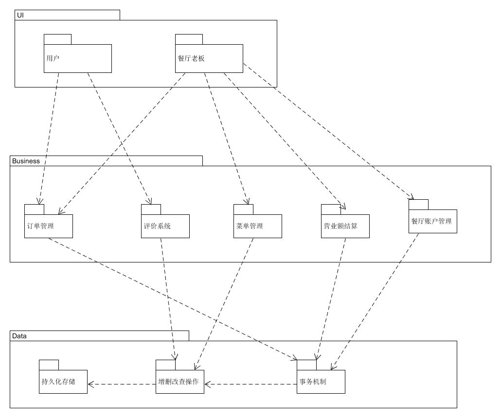

## 1.逻辑架构图


## 2.框架目录图
### 2.1 前端
```
.
├── assets
│   └── ...
├── components
│   ├── mainpage
│   │   ├── category.vue
│   │   ├── dish.vue
│   │   ├── dishDetail.vue
│   │   ├── dishList.vue
│   │   ├── guide.vue
│   │   ├── shopHeader.vue
│   │   ├── shoppingCart.vue
│   │   └── under.vue
│   ├── orderPage
│   │   ├── orderDishList.vue
│   │   └── under.vue
│   ├── payPage
│   │   └── choosePayWayRadio.vue
│   └── storeInfoPage
│       ├── storeImagSwipe.vue
│       ├── storeInfoList.vue
│       ├── storeInfoTitle.vue
│       └── storeIntro.vue            
├── pages
│   ├── mainPage.vue
│   ├── orderPage.vue
│   ├── payPage.vue
│   └── storeInfoPage.vue    
├── router
│   └── index.js
├── store
│   └── index.js
├── App.vue
└── main.js
```
### 2.2 后端

```
├── cnfig.py
│    └── ...
├── manage.py
|           
├── app
|   ├── models.py
|   |
|   ├── __init__.py 
|   |
│   ├── main
│   │   ├── _init_.py
│   │   └── views.py
|   |
│   ├── dish
│   │   ├── _init_.py
│   │   └── views.py
│   ├── order
|   |   ├── _init_.py
│   │   └── views.py
│   └── restaurant
│       ├── _init_.py
│       ├── views.py
│       └── order.py    
└──...

```

## 3.映射指南

ECB中：
 
- Entity：代表系统数据，如：订单、餐厅、菜品等  
- Boundary：与用户的接口，如：界面、网关、代理等
- Controller：在 Boundary 和 Entity 中衔接的媒介，编排来自 Boundary 的命令的执行  


在本系统中，Boundary有两个部分：

- 顾客端 Web 程序用户界面
- 服务端 Nginx 反向代理服务器

对应了架构图中的UI层（前端）

Controller 包含：

- 服务器框架目录设计中，controller 目录下定义了所有的相关内容，它们接收来自上述 Boundary 的命令，并编排 service 的执行
- 服务器框架目录设计中，service 目录下定义了部分相关内容，它们接收也会对来自 Boundary 的命令进行相应的编排

其模型对应用后台的models.py

Entity 包含：

- 服务器框架目录设计中，model 目录下定义了所有服务器与 MySQL 相关的实体，承载系统数据
- 服务器在会话管理中，与 Redis 通讯的相关部分

对应了数据库（持久化存储）

