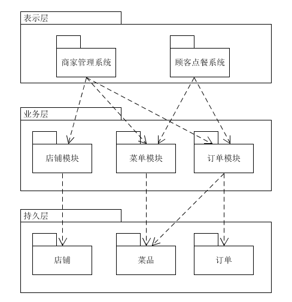

# 实践十一 架构建模 - 云时代的架构实践
### 个人作业 
### by 18214796

## 1.软件架构与框架之间的区别与联系
* <b>区别：</b>  
  <b>软件架构：</b>软件架构描述的对象是直接构成系统的抽象组件以及各个组件之间的连接，这些连接明确和相对细致地描述组件之间的通讯。在实现阶段，这些抽象组件被细化为实际的组件，比如具体某个类或者对象，组件之间的连接通常用接口来实现。  
  <b>软件框架：</b>软件框架描述了该领域的共性部分，并提供了一些定义良好的可变点以保证灵活性和可扩展性。软件框架是领域分析结果的软件化，领域内最终应用的模板。

* <b>联系：</b>  
  框架是一种或多种架构的组合的实现。
  框架技术和架构技术都是通过分治的方法解决软件系统日益复杂所带来的困难。

## 2.以我们的项目为例 
### （1）绘制三层架构模型图：

### （2）三层架构给开发者带来的便利
* 每个层或包的职责是清晰的，模块化并可扩展的。系统分析的每个类会明确地放置；
* 提供了隐式的程序复用准则；
* 每个层涉及的技术是明确的，这使得程序员可以通过快速培训上岗；
* 通过依赖估计项目变化产生的工作量；
* 开发次序和重要性是明确的。领域模型、基础模块（用户和基础数据的DTO和Servic必须优先开发与测试），减少这些模块的错误，特别是领域模型设计失误，是项目成功的关键；
* 并行开发支持，利用前后端分离，可实现并行开发；
* 在后期维护的时候，极大地降低了维护成本和维护时间。

## 3.研究VUE 与 Flux 状态管理的异同
* <b> Flux 状态管理 </b>  
  * React本身只涉及UI层，如果搭建大型应用，必须搭配一个前端框架。即React +前端框架才能基本满足需要。Facebook官方使用的是Flux框架。React标榜自己是MVC里面V的部分，那么Flux就相当于添加M和C的部分。使用Flux组织代码和安排内部逻辑，使得应用更易于开发和维护，它跟MVC架构是同一类东西，但是更加简单和清晰。Flux利用单向数据流的方式来组合React中的视图组件。  
  * Flux将一个应用分成四个部分：  
    View (视图层) :React 组件，这一层可以看作 controller-views，作为视图同时响应用户交互  
    Action（动作）：视图层发出的消息（比如mouseClick）  
    Dispatcher（派发器）：用来接收Actions、执行回调函数，处理动作分发，维护 Store 之间的依赖关系  
    Store（数据层）：数据和逻辑部分，用来存放应用的状态，一旦发生变动，就提醒Views要更新页面  
  * 在相对独立的组件中，Action -> Store -> View 的单向数据流能得到保证。  

* <b>VUE 状态管理 </b>  
  * Vuex 是一个专为 Vue.js 应用程序开发的状态管理模式。它采用集中式存储管理应用的所有组件的状态，并以相应的规则保证状态以一种可预测的方式发生变化。  
  * 状态管理包含以下几部分：  
    store：相当于一个容器，；它是响应式的在全局都可以使用它；一个应用里只能定义一个 store容器  
    state：这里对象里面放了各种状态（变量）  
    mutations：唯一用来修改状态的回调函数，但不支持异步操作  
    actions：包含异步操作，提交mutations来修改状态  
    getters：在组件内部获取store中状态的函数  
    module：将store分割成不同的模块  
  * 完整的 Vuex 动作是这样的：   
    Components( 组件 )中 methods 里面一个方法 dispatch （调用）Actions，Actions 然后 commit 对应的Mutations 只有Mutations 可以操作 State 中的状态数据，状态一改变，组件中就重新渲染。应用级的状态由store集中管理。修改状态的唯一方式是commit同步的mutation。异步逻辑放在action里。  

* <b>区别 </b>   
与flux对比，最大的区别是Vuex把action细分成了action和mutation，分别应对异步场景和同步场景，由store自身充当dispatcher（负责注册/分发action/(mutation)。即如果把action和mutation看作一层（Flux里的action），二者结构完全一致。