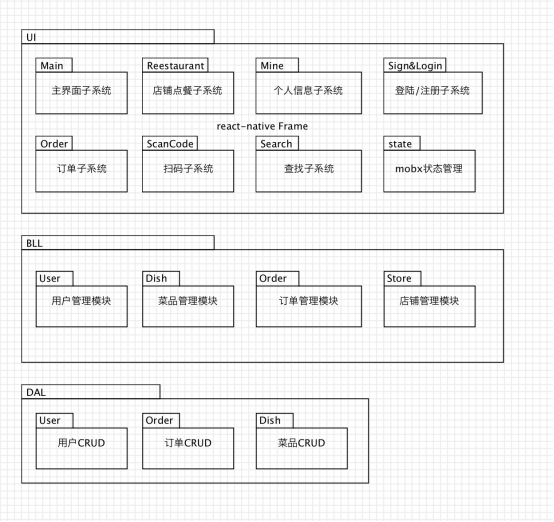

# 实践十一 架构建模 - 云时代的架构实践
### 个人作业 
### by 18214687

## 1.软件架构与框架之间的区别与联系
* <b>软件架构</b>  
  架构（architecture）是一系列相关的抽象模式，用于指导大型软件系统各个方面的设计，是一个系统的草图，描述的对象是直接构成系统的抽象组件。各个组件之间的连接明确细致的描述组件之间的通讯。

* <b>软件框架</b>  
  框架（framework）是整个或部分系统的可重用设计，表现为一组抽象构件及构件实例间交互的方法，另一种定义为，框架是可被应用开发者定制的应用骨架，前者是从应用方面而后者是从墓地的方面给出的定义。

* <b>区别：</b>  
  - 框架是一种特殊的软件，它是为了构建解决方案提供良好的基础，而架构不是软件，它是用来描述软件如何设计的重要策略。
  - 框架是和具体语言和技术相关的，而架构关注的是软件本身的结构和行为。

* <b>联系：</b>  
  架构到框架是一种从大到小的关系。

## 2.以我们的项目为例 
### （1）绘制三层架构模型图：

### （2）三层架构给开发者带来的便利
* 开发人员可以关注整个结构中的其中某一层，而不用过多关注其他层
* 各个层的更新可以很容易进行
* 层与层之间的依赖
* 每个层的标准化容易进行
* 各层之间的复用更加容易

## 3.研究VUE 与 Flux 状态管理的异同
* <b>Vue状态管理</b>  
  Vuex是一个专为Vue.js应用程序开发的状态管理模式。它采用集中式存储管理应用的所有组件的状态，并以相应的规则保证状态以一种可预测的方式发生变化。  
  Vuex的核心是store，并且更改Vuex的store中的状态的唯一方法是提交 mutation，同时通过action进行异步操作，提交mutation来改变store状态。

* <b>Flux状态管理 </b>  
  在Flux状态管理当中，Views查询Stores（而不是 Models），并且用户交互将会触发Actions，Actions则会被提交到一个集中的 Dispatcher当中。当Actions 被派发之后，Stores将会随之更新自己并且通知Views进行修改。这些Store当中的修改会进一步促使Views查询新的数据。

* <b>相同点</b>  
  都是通过提交一个额外信息来对store状态进行修改。

* <b>不同点</b>   
  Vuex中将同步和异步更新使用不同的提交信息，同步提交mutation，异步提交action，而Flux中使用Actions来对store状态进行更改。