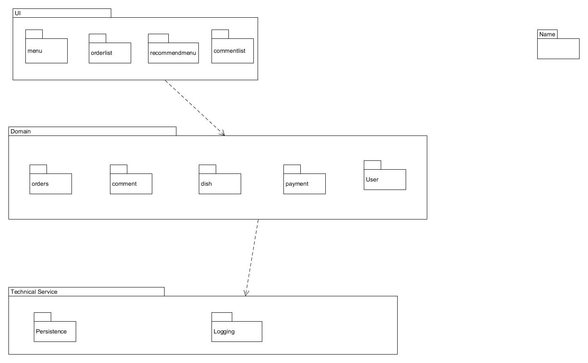
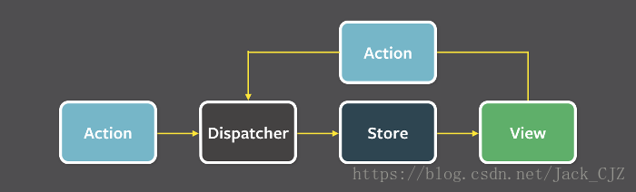
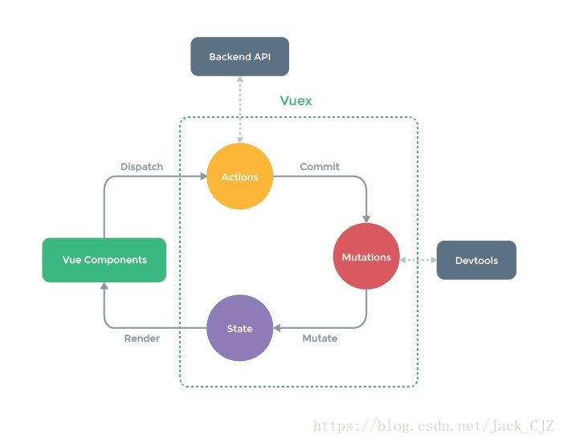

# 实践十一 架构建模 - 云时代的架构实践
### 个人作业 
### by 18214788

## 描述软件架构与框架之间的区别与联系

### 区别：
- 框架：
> 定义：
   框架（framework）是整个或部分系统的可重用设计，表现为一组抽象构件及构件实例间交互的方法，另一种定义为，框架是可被应用开发者定制的应用骨架，前者是从应用方面而后者是从墓地的方面给出的定义。

>  框架是一个可服用的设计构件，通常以构件库的形式出现，但构架库只是框架的一个重要部分，框架的关键在于框架内对象间的的交互模式和控制流模式。

- 架构
> 定义:
  软件架构（software architecture）是一系列相关的抽象模式，用于指导大型软件系统各个方面的设计，是一个系统的草图，描述的对象是直接构成系统的抽象组件。各个组件之间的连接明确细致的描述组件之间的通讯。

> 在实现阶段，这些抽象组件被细化为实际的组件，比如具体某个类或对象，在面向对象领域当中，组件之间的连接通常用接口来实现。软件体系结构是构建计算机软件实践的基础

- 二者区别在于框架是软件，架构不是软件。
> 框架是一种特殊的软件，它并不能提供完整无缺的解决方案，而是为你构建解决方案提供良好的基础。框架是半成品。典型地，框架是系统或子系统的半成品；框架中的服务可以被最终应用系统直接调用，而框架中的扩展点是供应用开发人员定制的“可变化点”。
> 软件架构不是软件，而是关于软件如何设计的重要决策。软件架构决策涉及到如何将软件系统分解成不同的部分、各部分之间的静态结构关系和动态交互关系等。经过完整的开发过程之后，这些架构决策将体现在最终开发出的软件系统中；当然，引入软件框架之后，整个开发过程变成了“分两步走”，而架构决策往往会体现在框架之中。

### 联系： 
- 软件架构和软件框架的联系 框架技术和架构技术的出现，都是为了解决系统日益复杂所带来的困难而采取的“分而治之”的思维的结果 - 先大局后局部，就出现了架构；先通用后专用，就出现了框架。架构是问题的抽象解决方案，关注大局而忽略细节；而框架是通用半成品，还必须根据具体需求进一步定制开发才能变成应用系统。
- 软件架构引导开发人员设计软件框架，是软件框架的重要决策。也就是说软件架构体现在软件框架中。

## 以你的项目为案例，
### 1. 绘制三层架构模型图，细致到分区
### 2.结合你程序的结构，从程序员角度说明三层架构给开发者带来的便利

1. 架构图

 

2. 
- 总的来说，使用三层架构可以做到关系分离、高级服务与低级服务分离、特定于应用的服务与一般性服务分离。三层架构可以减少耦合和依赖性、增强内聚性、提高潜在的复用性并且使概念更加清晰。这可以使得不同层的开发者之间专注于本层开发，而无需考虑除本层以外的开发。在我的程序中，UI层、Domian层和Technical层三者之间的耦合度很小，从而使得各层的开发相互独立，大大提高了开发和调试的效率。

- 封装和分解了相关的复杂性，有利于提供开发效率。在我的程序中，显示菜单数据、处理订单数据和存储交易数据相互分开，数据流得到了有效组织和管理，从而大大减少了开发复杂度。
较低层的复用性较高，为开发者减少了重新开发的麻烦以及代码量。
通过逻辑划分，有利于开发者进行高效的团队开发。

- 各个层次清晰，每个层次都提供了接口定义：
> 很容易用新的实现替换原来的层次实现。例如对sql进行性能优化，并不会影响其他层的代码结构。有利于后期维护。

> 有利于实现切面编程，减轻业务的复杂程度，加快编码效率。

> 每个层次的定位明晰，业务处理的内容明确。依据层次，可以划分不同的分工。开发人员可以只关注整个结构的其中某一层。

> 接口定义也提供了良好的可扩展性。例如数据库从mysql切换到oracle，只需要通过配置来切换。

> 接口设计需要符合对扩展开发，对修改关闭的原则，增强了系统的安全性

## 研究 VUE 与 Flux 状态管理的异同

- 同： Flux 思想是为了解决传统 MVC 架构不能有效解决大型业务中复杂数据流的管理问题而产生的一种软件架构思想。VUE 和 Flux 的状态管理都是基于 Flux 思想的有效实现，通过对数据流进行严格管理来规范数据在 Web 应用中流动方式的框架。

- 异： VUE 与 Flux 在状态管理上的差异主要体现在对数据流的管理方式不同。

> Flux 通过强制数据的单向流动来解决业务数据复杂度的问题。它主要将一个应用分成四个部分：

   >> View： 视图层

   >> Action（动作）：视图层发出的消息（比如mouseClick）

   >> Dispatcher（派发器）：用来接收Actions、执行回调函数

   >> Store（数据层）：用来存放应用的状态，一旦发生变动，就提醒Views要更新页面

> 数据流顺序是
>> View 发起 Action --> Action 传递到 Dispatcher --> Dispatcher 接收 Action，并通知 Store 进行更新 --> --> Store 更新状态并通知 View 进行改变 --> View 收到通知后，更新相应页面内容

其结构图：

> VUE 的状态管理由vuex实现。VUE 没有使用 Dispatcher 来接收 Actions 、执行回调函数并通知 Store 改变状态，而是通过使用 Mutation 来改变状态。VUE 的状态管理的核心概念如下：

   >> State: Vuex 使用 单一状态树 —— 是的，用一个对象就包含了全部的应用层级状态。至此它便作为一个『唯一数据源(SSOT)』而存在。这也意味着，每个应用将仅仅包含一个 store 实例。

   >> Getters: 从state中获取状态值

   >> Mutation: 更改 Vuex 的 store 中的状态的唯一方法是提交 mutation。Vuex 中的mutations 非常类似于事件：每个 mutation 都有一个字符串的 事件类型 (type) 和 一个 回调函数 (handler)。这个回调函数就是我们实际进行状态更改的地方，并且它会接受 state 作为第一个参数

   >> Action: 类似于 mutation，不同在于：Action 提交的是 mutation，而不是直接变更状态；Action 可以包含任意异步操作。

> VUE 的状态变更相当于是 action 产生的副作用，mutation 的作用是将这些副作用记录下来，这样就形成了一个完整数据流闭环，数据流的顺序如下：
>> 在视图中触发 action，并根据实际情况传入需要的参数 --> 在 action 中触发所需的 mutation，在 mutation 函数中改变 state --> 通过 getter/setter 实现的双向绑定会自动更新对应的视图

其结构图：

ps： 以上参考自博客：

[软件架构与框架](https://blog.csdn.net/jack_cjz/article/details/80550805)

[软件架构设计学习总结（17）：架构和框架的区别](https://www.cnblogs.com/dengyungao/p/7543316.html)
