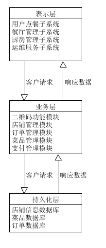

# 18214663 实践十一作业

## 1.软件架构与框架之间的区别与联系  
* <b>区别：</b>  
  软件架构把系统分解为一些部件，描述这些部件的职责及它们之间的协作行为，和语言无关。架构模式提供了特定领域常见问题的解决方案，如信息系统领域、结构化设计领域、消息服务领域等。而框架是特定语言和技术的架构应用解决方案，和语言有关，专注于业务场景的具体解决方案，如视图解决方案、持久化解决方案等。

* <b>联系：</b>  
  框架是一种或多种架构的组合的实现；架构指导了框架的设计思想。

## 2.以我们的项目为例 
### （1）绘制三层架构模型图：

### （2）三层架构给开发者带来的便利
* 开发人员可以只关注整个结构中的其中某一层
* 可以降低层与层之间的依赖
* 利于各层逻辑的复用
* 项目结构更加的明确
* 在后期维护的时候，极大地降低了维护成本和维护时间

## 3.研究VUE 与 Flux 状态管理的异同
* <b> Vue </b>  
  Vue的状态管理是通过Vuex处理的。Vuex通过store对实例的数据进行保存，在store中包含共享的状态state以及改变状态的方法mutations。通过getters把需要共享的数据进行包装然后共享。mutations是同步更改状态，异步的方法为actions，不过actions提交的同样是mutations

* <b> Flux </b>  
  View 发出 Action，然后Dispatcher 收到 Action，要求 Store 进行相应的更新，在Store 更新后，发出一个"change"事件，View 收到"change"事件后，更新页面。整个过程的数据流是单向的，防止同一份数据被多个地方同时写造成混乱。 

* <b> Vue 与 Flux 状态管理的区别 </b>   
  * 数据流  
  Flux的数据流为View 发出 Action，然后Dispatcher 收到 Action，要求 Store 进行相应的更新，在Store 更新后，发出一个"change"事件，View 收到"change"事件后，进行更新。
   
  Vuex的数据流为View调用commit（同步）或者dispatch（异步）方法提交对应的请求到Store中，然后调用对应的mutation函数对store进行更改并生成新的state，然后自动渲染。  

  * Flux数据改变需要对view进行更新，而Vuex有自动渲染的功能不需要更新

* <b> Vue 与 Flux 状态管理的相同 </b>
  * 两者的数据流都是单向的，这样所有的状态变化都可以留下记录，方便利用这个来做各种 debug 工具、历史回滚等等。
  * 两者都是通过store进行数据、状态的存储。