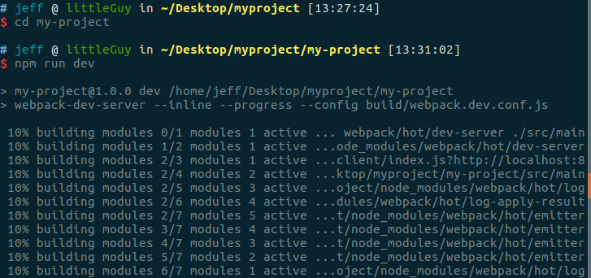
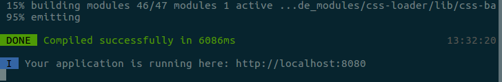
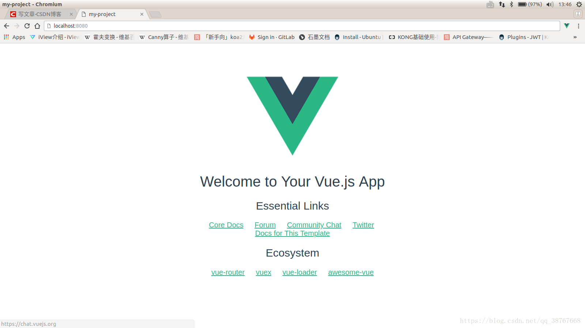
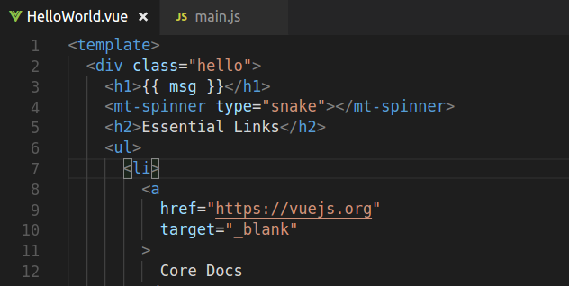
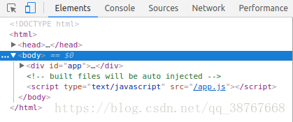
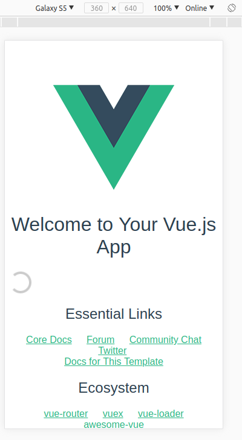

## vue-cli构建Vue应用的学习总结
#### by 18214796 

### <b>一、Vue介绍</b>
“Vue是一套用于构建用户界面的渐进式框架。与其它大型框架不同的是，Vue 被设计为可以自底向上逐层应用。Vue 的核心库只关注视图层，不仅易于上手，还便于与第三方库或既有项目整合。另一方面，当与现代化的工具链以及各种支持类库结合使用时，Vue 也完全能够为复杂的单页应用提供驱动。”这是Vue.js的官网对Vue的简介。我在小组中负责顾客端订餐页面的设计，通过了解饿了么的移动端web实现，我决定使用Vue作为前端设计页面的框架。  
根据以往对Nodejs中Express框架和Koa框架的了解，我和队友商议决定此项目用vue-cli构建项目。

### <b>二、Vue-cli介绍</b>
vue-cli是vue提供的一款脚手架，集成了webpack环境及主要的依赖，对于项目的搭建、打包、维护等都非常方便快捷。它的特点有：

- 有一套成熟的vue项目架构设计，能够快速初始化一个vue项目。
- vue-cli是官方支持的一个脚手架，维护性比较好。
- vue-cli提供了一套本地的node测试服务器，使用vue-cli自己提供的命令，就可以启动服务器。
- 集成打包上线方案。
- 还有一些优点，包括：模块化，转译，预处理，热加载，静态检测和自动化测试等。


### <b>三、安装及使用vue-cli新建项目</b>
```
# 全局安装vue-cli
npm install -g vue-cli
# 创建一个基于webpack模板的新项目my-project
# 在此过程中按需填写项目名，项目描述，作者，是否安装vue-router等信息
vue init webpack my-project
# 进入项目，安装依赖并运行
cd my-project
npm run dev
```
<br>


<br>



<br>



<br>

访问localhost:8080可以看到如下页面，说明成功新建了一个vue项目  

<br>



<br>

### <b>四、在新项目上使用Mint UI</b>
>Vue便于和第三方库整合，在此项目中，我尝试使用了Mint UI这个来自饿了么的移动UI库。  
```
# 在项目中安装mint-ui
npm i mint-ui -S
```
>然后在项目中的文件main.js添加如下：
```
import MintUI from 'mint-ui'
import 'mint-ui/lib/style.css'

Vue.use(MintUI)
```
>然后就可以在项目中使用Mint UI的组件了。在这里用ＨelloWorld.vue中添加Mint UI的Spinner组件做个示范：  
<br>

  

<br>

可以看到Spinner已经显示在网页中:  

<br>


### <b>五、Chromium模拟移动端显示</b>
谷歌浏览器可以模拟移动端显示，在调出调试窗口之后（右键-检查，或者按F12），可以看到左上角有个不明显的手机标志（下图蓝色部分），点击即可模拟移动端显示:  
<br>  
  
<br>
效果如下图，还可以调节型号和屏幕分辨率。虽然说不上完美地模拟真机，但非常方便流畅。  
<br>
